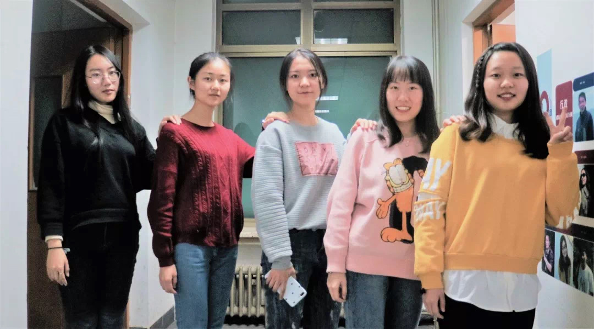
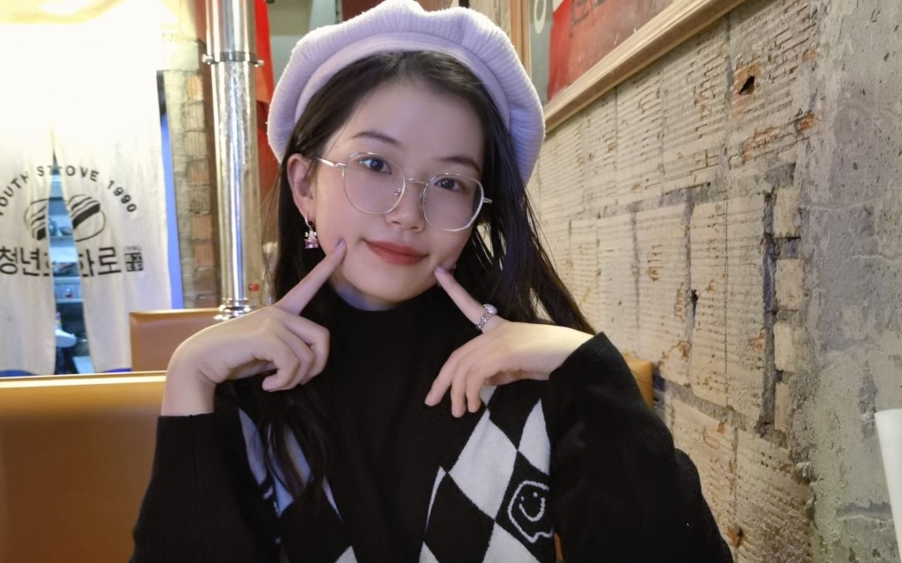
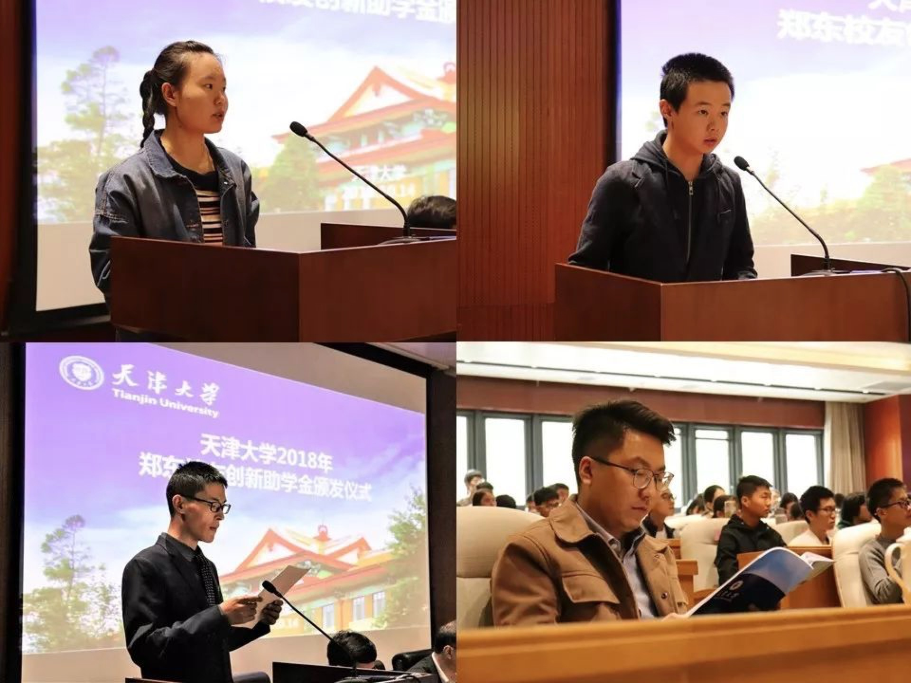

# 04-16 TUE

### 绵中英才 2015

该校2015级自2012或2011年入学以来以卓越的信念，赢得了多项殊荣：

2015年的“2014年度四川省五·四红旗团总支”（全省教育系统仅此一个）&#x20;

连续三年全市期末统考全市第一

2015年中考，英才参考人数1277人

★罗一帆同学以752分的优异成绩勇夺全市2015中考状元（不含任何比赛加分，全市状元仅此一名）&#x20;

★全市前10名英才占6人（罗一帆、邓志信、沈君陶、周汐玥、白欣茹、王研）&#x20;

★全市前50名英才占26人

★700分以上特优生361人，占全市特优生人数的1/4；上绵中、南山指令性计划线（含定向）1036人，上线比例高达81.2

★四川省一类高中（原国家级示范性高中）上线人数1201人，上线比例高达94℅；&#x20;

2015年的中考是绵阳中学英才学校2014年位居绵阳市各类学校榜首后，再次居全市第一！

### 绵阳中学 2018

理科省前十占3人，理科689分以上13人，600分以上特优生2100多人，重本上线 2833人

***

周汐玥，我在五年级进入绵中英才时的同班同学，她六年级进入四年制初中而与我分班[^1]。窈窕淑女，我不是君子我也好逑。在6年级前的暑假，千千万万遍地听周杰伦《说好的幸福呢》来缅怀这短暂的同学时光，在睡梦中挤出了几滴不争气的眼泪。一年后，在军训结束的表彰大会上，她作为学生代表演讲。初中三年，偶尔在食堂相聚的时候，也未招呼。中考结束后，我得知她取得全市前十的中考佳绩，在QQ上向她表示祝贺，之后就再也没联系。直到最近我才得知她去了北京师范大学国际瀚德学院经济与贸易专业（法语）。

【 注：同她一起进入四年制初中的还有谢贤慧（女，成都中医药大学中医学5+3），何伟（男），闫佳洋（女，重庆师范大学），胡涵成（男）等。】

章蕾，我在五年级进入绵中英才时的同班同学。窈窕淑女，我不是君子我也好逑。在六年级小升初考试当中荣获三万九千元的最高奖学金，初中进入小火箭学习。高考后进入北京林业大学工商管理类学习会计学。高考后，我陷入自闭，自觉不配有朋友，几乎把以前的同学删了个遍。

我完全知晓自身的平庸的，但是当我得知她们也泯然众人还是久久不能平息。曾经的全市前十、曾经的绵中英才最高奖学金，或许不应该如此，至少我曾期望着她们会有更加耀眼的成就。

***

9月9日补充部分人员（排名不分先后，想起谁写谁）：

鲍思成：初中时期常霸占年级第一的宝座，高考后进入中央财经大学学习统计学。

范云霄：小升初三万九奖学金（最高档），高考后进入中科大物理学院，不过有可能是竞赛保送，没高考。

张冬琦：小升初三万九奖学金（最高档），高考后进入天津大学工科试验班（精仪与光电信息类），研究生天大085400电子信息01光学工程方向。据悉，父母在汶川地震中遇难后由姨妈抚养成人。

李国栋：初一第一学期月考，一鸣惊人夺得状元，高考后进入电子科技大学

余睿之：初中下铺/面对角斜下铺，初中成绩优异，后进入绵中小火箭，18年失利上海理工，复读一年华东师范大学。

余尚泽：初中班上三个姓余的之一，初三后期理综大爆发，笔者以为他能在高中再续辉煌，结果去了西华大学……

黄达：初中第一学期期中考试，语数外排名年级第2，后逐渐乏力，沦落至绵中平行班。高考后进入常州大学。无敌的是从小学到研究生几乎都没有空窗期，每个阶段都能耍上朋友，而我恰恰是他的对立面，全是空窗期。

何嘉祺：小学时和黄达和我关系不错，小升初后他也是咱们三中唯一的小火箭，初中有时能进前50（绵中小火箭水平），结果中考后进入绵中平行班。高一分班，被选入小火箭，但放弃资格，宁做鸡头不做凤尾。两年半后失利进入西南财经大学，研究生保研至中山大学岭南学院。

邓丁文：五年级结束的夏令营认识刚转来他，没想到一年后分到了一个班。初一同我一起加入信息竞赛，不过我早早退出了。语文和我一个水平，或是略好于我，数理拔尖，初三下时常靠着数学理综名列前茅，近乎绵中小火箭水平。高考后进入北京化工大学自动化类，21年分流至测控技术与仪器。

魏小涵：六年级和我一起担任数学科代表，初中恰巧也分到一个班，应该大体上有个绵中大火箭的水平。高考后只上了成都理工。不过在高考后的暑假，她和男朋友一起去了厦门，学生时代的爱情……

***

<figure><figcaption>
周汐玥（右一），来源：<a href="https://mp.weixin.qq.com/s/qx0DAgO3UrDCB9ItoTWZCg">北师经管院会</a>
</figcaption></figure>

<figure><figcaption>
谢贤慧，来源：<a href="https://mp.weixin.qq.com/s/eUMdbPpBChmbDlSdcx_ZxA">成都中医药大学本科招生办公室 微信公众号</a>
</figcaption></figure>

<figure><figcaption>
张冬琦（右上） 来源：<a href="http://pyedf.tju.edu.cn/news/newsinfo?id=566">天津大学举办2018年郑东校友创新助学金颁发仪式</a>
</figcaption></figure>

[^1]: 同她一起进入四年制初中的还有谢贤慧（女，成都中医药大学中医学5+3），何伟（男），闫佳洋（女，重庆师范大学），胡涵成（男）
